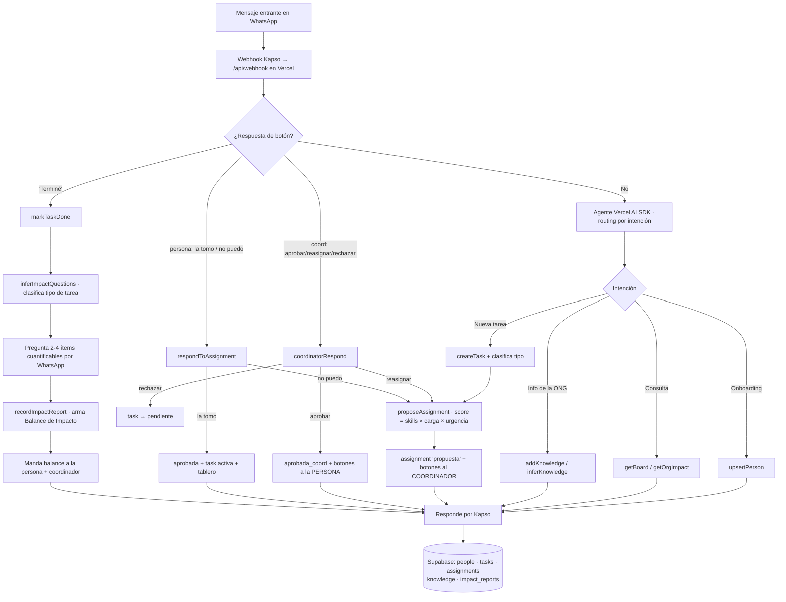

# PRD · Coordinador de Equipo + Balance de Impacto para ONGs (WhatsApp)

> **Hackatón Solidaria (Halketon) — Paisanos · Crecimiento Build · Querido Lunes · Fardo**
> Track 1 — Coordinación y memoria interna · 6 de junio de 2026
> Equipo: 1 Backend · 1 ML · 1 Data Engineer · **Ventana: 4 horas para el MVP**
> *Nombre de trabajo: **"Pulso"** · v3 (suma doble aprobación con Coordinador)*

---

## 1. Resumen ejecutivo

Las ONGs chicas y sobrecargadas pierden la coordinación del trabajo cotidiano porque la información se dispersa entre WhatsApp, mail, Drive, Trello/Asana/Notion y planillas, y ninguna herramienta se sostiene en el tiempo. **El único canal que todos ya usan, todos los días, es WhatsApp.**

Pulso es un **agente que vive dentro de WhatsApp** y cubre el ciclo completo del trabajo de la organización, de punta a punta:

1. **Coordina** — registra personas y tareas, sabe qué sabe hacer y qué tan cargada está cada persona, **propone asignaciones que un coordinador aprueba y la persona confirma con un botón**, y mantiene un tablero consultable.
2. **Supervisa** — un coordinador/manager tiene la última palabra sobre quién hace qué, con la carga real de cada persona a la vista. Esto le da a la dirección el control que hoy no tiene.
3. **Recuerda** — guarda e **infiere** el conocimiento de la organización, de modo que la memoria operativa no dependa de una sola persona (y no se vaya cuando se va un voluntario).
4. **Mide** — cuando una tarea termina, el agente **infiere las preguntas justas según el tipo de tarea** y arma un **Balance de Impacto**: un cierre con números concretos, estilo balance contable, pero donde la "moneda" es el impacto generado.

El valor es doble: resuelve el dolor **operativo** (coordinación + supervisión, Track 1) y el dolor **perenne de reportar impacto a donantes** —que hoy las ONGs hacen a mano, a fin de año, juntando datos dispersos. Con Pulso el impacto se captura en el momento, tarea por tarea, sin instalar nada y sin capacitación.

---

## 2. Contexto y problema (Why)

El relevamiento de 16 organizaciones identificó dos dolores en el Track 1, y la conversación con un stakeholder agregó un tercero:

- **Dispersión de herramientas.** No logran sostener un sistema único y compartido. La info vive en muchos lados y ninguna combinación sobrevive al uso real del equipo en el tiempo.
- **Momentos críticos.** El problema aparece cuando hay que ver *quién hace qué*, *qué vence cuándo*, *qué es prioritario* y *quién está sobrecargado*. Las responsabilidades se asignan bien en reuniones, pero los plazos se pierden y **la dirección no tiene un lugar donde ver ni controlar la carga real**.
- **El trabajo no tiene un final medido.** Las tareas se dan por "hechas" sin capturar qué resultado dejaron. Después, cuando hay que rendirle a un donante o a una asamblea, el equipo reconstruye los números de memoria. **Medir impacto es manual, tardío y doloroso.**

**Por qué WhatsApp.** Cualquier solución que requiera adoptar/aprender una herramienta nueva tiene alta probabilidad de no sostenerse —es lo que ya les pasó con Trello, Asana, Notion. WhatsApp tiene adopción del 100 % y fricción cero: el desafío no es construir "otra app", sino **traer el trabajo al canal donde el equipo ya está**.

**Por qué un agente con coordinador en el medio.** Equipos chicos no van a memorizar comandos. Un agente en lenguaje natural baja la fricción a "escribile como a un compañero". Pero la asignación de trabajo en una ONG no es 100 % automática: hay un coordinador que conoce el contexto, las prioridades y a la gente. Por eso el agente **propone** y el coordinador **decide** —el mejor de los dos mundos: la velocidad del agente con el criterio humano.

**Por qué la rotación importa.** En ONGs la rotación de voluntarios es alta. Hoy, cuando alguien se va, se lleva el conocimiento (quién sabe hacer qué, cómo se hacía un proceso, qué impacto tuvo una actividad). La memoria inferida de Pulso convierte ese conocimiento tácito en memoria de la organización: **cuando un voluntario se va, lo que aprendió queda.**

---

## 3. Propuesta de producto (What)

Un agente en WhatsApp que cubre el ciclo completo:

1. **Registro de personas** — onboarding de baja fricción, auto-reportado desde el chat. Incluye un flag mínimo de **coordinador**.
2. **Asignación con doble aprobación** — el agente **propone** el mejor responsable (skills + carga + urgencia); un **coordinador aprueba o reasigna**; la **persona confirma** con un botón (*human-in-the-loop* en dos puntos: quién y si puede).
3. **Memoria de la organización** — guarda info explícita e **infiere** datos nuevos de las conversaciones.
4. **Balance de Impacto al cerrar** — al terminar una tarea, el agente infiere preguntas a medida del tipo de actividad y arma un cierre cuantificado.

Más un **tablero consultable desde WhatsApp** (tareas por estado + pendientes de aprobación + alertas de vencimiento + impacto reciente) que se actualiza con cada cambio.

### Principios de diseño
- **Fricción cero**: lenguaje natural + botones/listas. Nada de formularios largos ni comandos.
- **El agente propone, los humanos deciden**: el coordinador decide *a quién*, la persona decide *si puede*. El agente nunca asigna solo ni inventa números.
- **Carga y control visibles**: el coordinador ve la carga real antes de aprobar; la dirección pregunta "¿cómo venimos?" y ve estado, vencimientos e impacto.
- **La tarea tiene un final que importa**: no se cierra en "hecha", se cierra en un balance con números.
- **La memoria es el valor**: el sistema se vuelve más útil cuanto más lo usan, porque aprende.

---

## 4. Usuarios y casos de uso

| Rol | Qué hace en el sistema |
|---|---|
| **Integrante del equipo** | Se da de alta, recibe propuestas (ya aprobadas por el coordinador), acepta/rechaza, reporta avance y **responde el balance al cerrar**. |
| **Coordinador / Manager** | Recibe las propuestas del agente, **aprueba / reasigna / rechaza** las asignaciones con la carga del equipo a la vista, crea tareas y lee el tablero. |
| **Dirección / quien rinde a donantes** | Consulta tablero y carga, y usa los **balances de impacto** acumulados para rendir cuentas. |
| **Agente (sistema)** | Onboarda, registra tareas, propone responsables al coordinador, infiere conocimiento, **infiere preguntas de impacto y arma el balance**, avisa vencimientos. |

> **Roles en el MVP:** la única distinción es un flag `is_coordinator` en `people` (no es RBAC completo). El coordinador puede aprobar asignaciones; todo lo demás lo puede hacer cualquiera. Permisos finos por rol quedan fuera de alcance.

---

## 5. Alcance del MVP (in / out)

Con 4 horas, la regla es: **que el ciclo central funcione punta a punta en una demo en vivo, con la doble aprobación, y que termine en el Balance de Impacto.**

### ✅ Núcleo demo-crítico
1. Onboarding de una persona desde WhatsApp (3-4 preguntas, con botones). Al menos un coordinador seedeado.
2. Alta de una tarea en lenguaje natural.
3. El agente **propone** el mejor responsable (skills + carga) **con justificación** y se lo manda al **coordinador** con botones ✅ Aprobar / ❌ Rechazar (🔄 Reasignar = nice-to-have).
4. Coordinador aprueba → la **persona** recibe ✅ La tomo / ❌ No puedo → al aceptar, la tarea queda activa y el tablero se actualiza.
5. La persona marca la tarea como terminada → **el agente infiere 2-4 preguntas según el tipo de tarea y arma el Balance de Impacto** (versión mínima: una tarea, un balance bien renderizado).
6. Consultar el tablero / impacto desde WhatsApp ("¿cómo venimos?").

> El paso **5 es la feature estrella** y la **doble aprobación (3-4)** es el diferenciador de gobernanza. Si falta tiempo, se recortan los nice-to-have de abajo antes que estos.

### 🟡 Nice-to-have (si sobra tiempo)
- **Reasignar** desde el coordinador (elegir otra persona vía lista) en lugar de solo aprobar/rechazar.
- Inferencia de conocimiento desde la conversación (el agente "aprende" skills/disponibilidad).
- Búsqueda de conocimiento de la ONG (`searchKnowledge`).
- Recordatorios de vencimiento (Vercel Cron).
- Balanceo entre **varios** candidatos y tareas que necesitan **varias personas**.
- Vista agregada de impacto (feed de titulares + rollup por tipo).

### ❌ Fuera de alcance (no tocar hoy)
- **WhatsApp Flows** → requieren *Meta Business Portfolio verificado* (días de trámite). Bloqueante.
- RBAC completo / permisos finos por rol (solo existe el flag `is_coordinator`).
- Búsqueda semántica con `pgvector`/embeddings (usar texto simple).
- Agregación cross-métrica "real" del impacto (problema de diseño aparte; ver §11).
- Autenticación, RLS, multi-organización.
- Dashboard web (se resuelve con mensajes interactivos dentro de WhatsApp).

---

## 6. Flujos de usuario

**Onboarding (auto-servicio, baja fricción)**
Persona escribe "hola" → el agente detecta que no existe y **se presenta guiando solo**: *"¡Hola! Soy el asistente del equipo 🤝 Para empezar, contame tu nombre 👇"* → pide **área/rol**, **2-3 skills**, **disponibilidad** (botones: Baja/Media/Alta) → guarda y confirma. *(3-4 turnos, ~30 s.)*

**Alta de tarea**
Alguien escribe "Hay que mandar el informe a Huésped antes del viernes" → el agente extrae **título, descripción, prioridad, skills, deadline** y **clasifica el tipo de tarea** → confirma y crea la tarea en estado `pendiente`.

**Asignación con doble aprobación (corazón operativo)**
1. El agente puntúa candidatos (skills × carga × urgencia), elige al mejor y crea una asignación `propuesta`.
2. Le manda la propuesta al **coordinador** con la justificación y la carga del candidato: *"Propongo a Ana para esta tarea (vence viernes). Tiene el skill X y es la menos cargada hoy."* + botones **✅ Aprobar / 🔄 Reasignar / ❌ Rechazar**.
   - 🔄 Reasignar → el coordinador elige otra persona de una lista → vuelve al paso 2 con ese candidato *(nice-to-have)*.
   - ❌ Rechazar → la tarea vuelve a `pendiente`.
3. ✅ Aprobar → la asignación pasa a `aprobada_coord` y el agente le pregunta a la **persona**: *"El equipo te propuso esta tarea (vence viernes). ¿La tomás?"* + botones **✅ La tomo / ❌ No puedo**.
   - ✅ → asignación `aprobada`, tarea `aprobada`/`en_curso`, tablero actualizado, se avisa al coordinador.
   - ❌ → el agente vuelve a proponer al siguiente candidato (paso 2).

**Cierre + Balance de Impacto (el final que importa)**
La persona escribe "terminé" o toca **✅ Terminé** → el agente:
1. Pasa la tarea a `hecha` y **clasifica el tipo** (de título/descripción + knowledge base).
2. **Infiere 2-4 preguntas concretas y cuantificables a medida de ese tipo** (no es lo mismo medir una charla que un informe).
3. Las hace **de a una**, con quick-replies/números donde se pueda.
4. Arma el **Balance de Impacto** (tarjeta formateada) y lo manda a la persona + al coordinador/dirección.
5. Guarda el reporte estructurado; los datos enriquecen la memoria.

**Consultar tablero / impacto**
"¿Cómo venimos?" → tareas por estado + **pendientes de aprobación** + **alertas de vencimiento** + **impacto reciente**. "Mis tareas" → lista interactiva.

**Vencimientos (nice-to-have)**
Cron horario revisa tareas próximas a vencer/vencidas y manda un nudge al responsable.

### Diagrama del ciclo en runtime



---

## 7. El Balance de Impacto en detalle

La idea del stakeholder: **toda tarea termina con un balance**, como un asiento contable, pero la moneda es impacto. La clave es que el agente **no usa un formulario fijo**: infiere las preguntas correctas según el tipo de actividad.

### Estructura del balance (3 bloques + titular)
- **Inversión** (lo que se puso): horas dedicadas, personas involucradas, recursos/materiales.
- **Resultado** (lo que se produjo, números duros): personas alcanzadas, unidades entregadas, entregables, etc.
- **Impacto** (qué cambió): el efecto/outcome — una decisión que se tomó, satisfacción, seguimiento que generó.
- **Titular · "La cifra que cuenta"**: una métrica destacada que resume el valor (ej.: *"120 familias recibieron un kit"*).

### El agente infiere las preguntas (no formulario)
Al cerrar, el agente clasifica la tarea y genera **2-4 preguntas cuantificables a medida**. La tabla es un **prior/guía para el LLM** —lo adapta al caso, no es rígida:

| Tipo de tarea | Preguntas de impacto (ejemplos) | Titular típico |
|---|---|---|
| **Charla / taller** | ¿Cuántas personas asistieron? ¿Cuántas horas duró? ¿Hubo material/encuesta? ¿% que la valoró útil? | "N personas formadas" |
| **Informe / documento** | ¿A quién se entregó? ¿Se usó para una decisión o presentación? ¿Qué cubría? | "Informe usado en decisión X" |
| **Difusión / campaña** | ¿Qué alcance tuvo? ¿Cuántas interacciones? ¿Sumó voluntarios o donantes? | "N nuevos contactos" |
| **Atención directa** | ¿Cuántos beneficiarios? ¿Cuántas unidades (raciones, kits)? | "N familias asistidas" |
| **Gestión / trámite** | ¿Qué se resolvió? ¿Cuánto tiempo o recurso ahorró? | "Trámite X completado" |
| **Recaudación** | ¿Cuánto se recaudó? ¿Cuántos donantes nuevos? | "$X recaudados" |

**MVP:** un prompt que, dado título/descripción/tipo, genere 2-4 preguntas cuantificables apoyado en esta tabla. Tope de 4 preguntas, una por mensaje (anti-fricción). El agente **solo registra lo que responde la persona — nunca estima ni inventa números.**

### Por qué vale
- Le da a la tarea un **final que importa**, no solo "hecha".
- El **agregado de balances = el dashboard de impacto de la ONG** → criterio 5 ("cambio concreto y medible").
- Ataca el dolor de **reportar a donantes** (hoy manual y a fin de año; acá en el momento).
- **Enriquece la memoria**: el agente aprende qué impacto genera cada tipo de actividad.

---

## 8. Requisitos funcionales

- **RF1** — Alta de persona vía conversación, con primer mensaje que guía solo, flag de coordinador y confirmación.
- **RF2** — Alta de tarea por lenguaje natural, con extracción de deadline/skills y clasificación de tipo.
- **RF3** — El agente propone responsable con **justificación legible** y se lo manda al **coordinador** para aprobar/rechazar (reasignar = nice-to-have).
- **RF4** — Aprobada por el coordinador, la **persona** confirma con botón; aceptar activa la tarea y actualiza el tablero; rechazar (en cualquier gate) dispara re-propuesta o vuelve a `pendiente`.
- **RF5** — Marcar una tarea como terminada dispara el cierre.
- **RF6** — Al cerrar, el agente **infiere 2-4 preguntas a medida del tipo** y arma el **Balance de Impacto** (inversión / resultado / impacto / titular).
- **RF7** — El balance se persiste estructurado y es consultable.
- **RF8** — Tablero consultable (estado + pendientes de aprobación + vencimientos + impacto reciente).
- **RF9** — El agente persiste todo en Supabase y lee de ahí para decidir (carga real).
- **RF10–12** *(nice-to-have)* — Inferencia de conocimiento; recordatorios; vista agregada de impacto.

---

## 9. Accesibilidad y costo (la respuesta honesta al criterio 2)

**Sin internet estable / sync diferida → fortaleza heredada.** No construimos "modo offline": lo hace WhatsApp (*store-and-forward*). Si la persona está sin señal, sus mensajes se encolan y se entregan al reconectar. **La carga de conectividad está en el servidor (cloud), no en la ONG.**

**Android básico, sin app, sin config → el punto más fuerte.** WhatsApp ya está instalado. Cero app nueva, cero configuración del lado del usuario.

**Costo → near-zero para una ONG chica, con un asterisco honesto.**
- **Kapso**: plan gratuito de **2.000 mensajes/mes** (cuenta entrantes + salientes), 1 número, agentes de IA + sandbox incluidos. Para una ONG chica, alcanza.
- **Meta**: desde el 1/7/2025 los mensajes que **no** son template son **gratis dentro de la ventana de 24 h**; solo se cobran templates. Como Pulso es **reactivo**, el uso normal **no paga Meta**.
- **LLM (tokens)**: único costo recurrente real; centavos al volumen de una ONG chica.
- **Asterisco**: recordatorios proactivos fuera de las 24 h requieren template (poco, utility). Mitigación: mandarlos dentro de una conversación activa.
- **Claim defendible (no decir "gratis"):** *"Corre en planes gratuitos de Kapso y Supabase; Meta no cobra el uso reactivo; el costo marginal por ONG es de centavos al mes."*

**Adopción vs. setup.** El **integrante** se onboarda en un minuto (cero técnico). El **alta de la organización** (conectar número/WABA + deploy) es un **setup técnico único** que hace quien implementa —se puede ofrecer como "lo dejamos andando por vos".

---

## 10. Arquitectura técnica (How)

### Stack
- **WhatsApp ↔ Kapso** (`api.kapso.ai`, wrapper de WhatsApp Cloud API v24.0). Entrada por **webhook** (`whatsapp.message.received`); salida por **send message** (texto, **botones** —máx 3—, **listas** —máx 10—). Usar el **Kapso Sandbox** para la demo.
- **Vercel** — hostea el webhook (`/api/webhook`) y el agente. Cron opcional para vencimientos.
- **Vercel AI SDK** (`ai`) — el agente: `generateText` + `tool()` con **tool calling multi-paso** (AI SDK v5: `stopWhen: stepCountIs(n)`; v4: `maxSteps`). Args con **Zod**.
- **Supabase (Postgres)** — persistencia. **Relacional, no buckets ni KV** (ver §11).

### Modelo de datos (Supabase)

```sql
-- Personas de la ONG
create table people (
  id uuid primary key default gen_random_uuid(),
  wa_phone text unique not null,
  name text not null,
  role text,
  skills text[] default '{}',
  capacity text default 'media',          -- baja | media | alta
  is_coordinator boolean default false,   -- único "rol" del MVP
  timezone text default 'America/Argentina/Buenos_Aires',
  active boolean default true,
  created_at timestamptz default now()
);

-- Tareas
create table tasks (
  id uuid primary key default gen_random_uuid(),
  title text not null,
  description text,
  task_type text,                         -- charla|informe|difusion|atencion|gestion|recaudacion|otro
  priority text default 'media',          -- baja | media | alta
  required_skills text[] default '{}',
  effort int default 1,                   -- esfuerzo relativo (1-5)
  deadline timestamptz,
  status text default 'pendiente',        -- pendiente|propuesta|aprobada|en_curso|hecha|bloqueada
  created_by uuid references people(id),
  created_at timestamptz default now()
);

-- Asignaciones (historial de la doble aprobación)
create table assignments (
  id uuid primary key default gen_random_uuid(),
  task_id uuid references tasks(id) on delete cascade,
  person_id uuid references people(id),         -- candidato propuesto
  status text default 'propuesta',              -- propuesta | aprobada_coord | aprobada | rechazada
  reason text,                                  -- por qué el agente lo propuso
  coord_id uuid references people(id),          -- coordinador que decidió
  coord_decision_at timestamptz,
  rejected_by text,                             -- 'coordinador' | 'persona' (si aplica)
  proposed_at timestamptz default now(),
  responded_at timestamptz                      -- cuándo respondió la persona
);

-- Conocimiento de la organización
create table knowledge (
  id uuid primary key default gen_random_uuid(),
  content text not null,
  kind text default 'hecho',              -- politica|proceso|hecho|inferido
  tags text[] default '{}',
  source text,
  created_at timestamptz default now()
);

-- Balance de Impacto (cierre de tarea)
create table impact_reports (
  id uuid primary key default gen_random_uuid(),
  task_id uuid references tasks(id) on delete cascade,
  reported_by uuid references people(id),
  task_type text,
  inputs jsonb default '{}',              -- { horas, personas, recursos }
  outputs jsonb default '{}',             -- { metricas duras del resultado }
  outcome text,                           -- qué cambió
  headline text,                          -- "la cifra que cuenta"
  raw_answers jsonb default '{}',         -- Q&A capturado
  summary text,                           -- balance formateado
  created_at timestamptz default now()
);

-- Carga REAL por persona (vista calculada)
create view person_load as
select p.id, p.name, p.capacity,
       coalesce(sum(t.effort) filter (where t.status in ('aprobada','en_curso')), 0) as active_effort,
       count(t.id)            filter (where t.status in ('aprobada','en_curso')) as active_tasks
from people p
left join assignments a on a.person_id = p.id and a.status = 'aprobada'
left join tasks t       on t.id = a.task_id
group by p.id, p.name, p.capacity;
```

> RLS **desactivado** en el MVP. Anotarlo como deuda técnica.

### Contrato de tools (definir esto PRIMERO)

```ts
// --- Personas ---
upsertPerson(input: { wa_phone: string; name?: string; role?: string;
  skills?: string[]; capacity?: 'baja'|'media'|'alta'; is_coordinator?: boolean }): Person
getPerson(wa_phone: string): Person | null
listCoordinators(): Person[]

// --- Tareas ---
createTask(input: { title: string; description?: string; task_type?: string;
  priority?: 'baja'|'media'|'alta'; required_skills?: string[];
  effort?: number; deadline?: string; created_by_phone: string }): Task
listTasks(filter?: { status?: TaskStatus; person_id?: string }): Task[]
getBoard(): { columns: Record<TaskStatus, Task[]>; pending_approval: Assignment[];
              alerts: Task[]; recent_impact: ImpactReport[] }

// --- Asignación con doble aprobación ---
proposeAssignment(task_id: string): { assignment: Assignment; candidate: Person; reason: string }
//   crea assignment 'propuesta' + sendButtons() al COORDINADOR (no a la persona todavía)
coordinatorRespond(assignment_id: string, decision: 'aprobar'|'reasignar'|'rechazar',
  new_person_id?: string): Assignment
//   'aprobar'  -> status 'aprobada_coord' + pregunta a la persona
//   'reasignar'-> re-propone a new_person_id (nice-to-have)
//   'rechazar' -> task a 'pendiente'
respondToAssignment(assignment_id: string, decision: 'aprobada'|'rechazada'): Assignment
//   gate de la persona; 'aprobada' -> task activa; 'rechazada' -> re-propone siguiente candidato

// --- Cierre + Balance de Impacto ---
markTaskDone(task_id: string): Task
inferImpactQuestions(task_id: string): { task_type: string; questions: string[] }
recordImpactReport(task_id: string, answers: Record<string,string>): ImpactReport
getImpactReport(task_id: string): ImpactReport | null
getOrgImpact(filter?: { task_type?: string }): { headlines: string[]; by_type: Record<string, number> }

// --- Conocimiento ---
addKnowledge(input: { content: string; kind?: string; tags?: string[]; source?: string }): Knowledge
searchKnowledge(query: string, limit?: number): Knowledge[]
inferKnowledge(conversationText: string): Knowledge[]

// --- WhatsApp (Kapso) ---
sendText(wa_phone: string, text: string): void
sendButtons(wa_phone: string, body: string, buttons: {id: string; title: string}[]): void  // máx 3
sendList(wa_phone: string, body: string, rows: {id: string; title: string; description?: string}[]): void
```

### Lógica de scoring (juguete del ML; arrancá simple)

```
score(person, task) =
    w1 · skillMatch(person.skills, task.required_skills)
  − w2 · normalizedLoad(person)
  + w3 · capacityBonus(person.capacity)
  + w4 · urgency(task.deadline)
```
**MVP (5 min):** filtrar por skills → menor `active_effort` → desempatar por `capacity`.
**Versión que luce:** pasar la lista de candidatos *con su carga* al LLM y que **elija y justifique** en lenguaje natural (se muestra en la propuesta al coordinador).

### Ruteo del webhook
1. `normalizeWebhook(req.body)` → eventos normalizados.
2. **Botón del coordinador** (`coord_approve:<id>` / `coord_reassign:<id>` / `coord_reject:<id>`) → `coordinatorRespond`.
3. **Botón de la persona** (`approve:<id>` / `reject:<id>`) → `respondToAssignment`. **`done:<task_id>`** → `markTaskDone`.
4. **Texto** → el agente rutea por intención (onboarding / nueva tarea / cierre / consulta / info de la ONG).
5. **Sesión de cierre activa** → acumula respuestas de impacto hasta completar y llama `recordImpactReport`.

---

## 11. Decisiones clave (Q&A)

**a) ¿Buckets / KV / relacional?** → **Relacional (Postgres).** Supabase *es* Postgres y los datos necesitan joins (carga, impacto, doble aprobación). Buckets = archivos (no aplica); no hay KV nativo. 5 tablas + 1 vista, minutos.
RTA: Un bucket de formato LLM WIKI con un index.md
https://gist.github.com/karpathy/442a6bf555914893e9891c11519de94f

**b) ¿MCP de Supabase en runtime?** → **No. MCP para dev-time; `supabase-js` para runtime.** El MCP que te cree esquema + vista + seed en Claude Code; el agente le pega con `supabase-js` directo. *MCP = andamiaje; `supabase-js` = músculo.*

**c) ¿"Tablero / UI dentro de WhatsApp"?** → **Mensajes interactivos, no Flows** (Flows piden verificación de Meta → bloqueante). Tablero = texto + lista; approve/done/coordinador = botones.

**d) Onboarding** → `nombre` · `área/rol` · `2-3 skills` · `disponibilidad` (botones) + flag coordinador (seedeado). Preguntas flexibles.

**e) Agregación del impacto** → métricas **heterogéneas** no se suman. **MVP:** feed de titulares + conteo por tipo (`getOrgImpact`). La agregación cross-métrica "real" es post-MVP.

**f) Doble aprobación — el orden y cuándo aplica:**
   - **Orden (default elegido):** agente propone → **coordinador aprueba/reasigna** (decide *quién*) → **persona confirma** (decide *si puede*). Razón: el coordinador controla la distribución (necesidad de la dirección) y la persona conserva autonomía, sin que nadie se comprometa a algo que después se veta.
   - **¿Cuándo se exige la aprobación del coordinador?** Configurable. MVP: **siempre** (muestra la gobernanza). En producción se puede limitar a tareas de alta prioridad/esfuerzo, o **solo a ciertas personas** (p. ej. voluntarios nuevos) — ése es el caso "a *x* personas".
   - **¿Quién es el coordinador?** MVP: uno seedeado (o varios; el primero que responde decide). Multi-coordinador con ruteo fino = post-MVP.

**g) Sandbox de Kapso** para la demo → primero del Backend; evita número productivo y verificación.

---

## 12. Plan de 4 horas y reparto por rol

**Bloque 0 (0:00–0:20) — Juntos:** cerrar §11, definir el **contrato de tools** (§10) y los estados de `task`/`assignment`. Crear repo + proyectos en Vercel y Supabase.

| Tiempo | **Backend** | **ML** | **Data Engineer** |
|---|---|---|---|
| 0:20–1:30 | Vercel + `/api/webhook` + parseo Kapso + **Sandbox** + helpers `sendText/Buttons/List` | System prompt + esqueleto del agente (`generateText` + tools) + ruteo por intención | Esquema Supabase (vía **MCP**) + `person_load` + seed (3-4 personas, **1 coordinador**) + wrappers `supabase-js` |
| 1:30–2:30 | Webhook → agente + manejo de botones de **coordinador** (`coord_*`) y **persona** (`approve/reject`) + `done` + deploy | `proposeAssignment` (→ coordinador) + `coordinatorRespond` + `respondToAssignment` + extracción/clasificación de tarea | `createTask/listTasks/getBoard` (incl. `pending_approval`) |
| 2:30–3:30 | **FEATURE ESTRELLA:** botón "Terminé" → sesión de cierre + render del **Balance de Impacto** | **`inferImpactQuestions` (adaptativo) + `recordImpactReport`** | Tabla `impact_reports` + `getOrgImpact` |
| 3:30–4:00 | **Juntos:** ensayar la demo punta a punta (coordinador aprueba → persona acepta → **termina en el balance**), fixear, pitch | | |

**Regla de oro:** a las **2:30**, ciclo de coordinación con doble aprobación cerrado (1-4). De 2:30 a 3:30, **todo al Balance de Impacto** (5). Si algo se cae, primero `reasignar` y `inferKnowledge`, después recordatorios. **El balance y la doble aprobación NO se negocian.**

---

## 13. Riesgos

| Riesgo | Mitigación |
|---|---|
| Doble aprobación agrega fricción | Coordinador-first + botones de un toque; gate configurable (solo ciertas tareas/personas en prod). |
| El coordinador es cuello de botella | Varios coordinadores posibles; el primero que responde decide (post-MVP: ruteo). |
| Flows bloqueados por verificación Meta | Ya descartados → mensajes interactivos. |
| Setup de Kapso/Sandbox come tiempo | Primera tarea del Backend; fallback con número de prueba. |
| El cierre pide demasiadas preguntas | Tope 2-4, una por mensaje, quick-replies. |
| El LLM inventa números | Solo pregunta y registra; nunca estima. |
| Métricas no agregables | Feed de titulares + rollup por tipo; agregación real post-MVP. |
| El LLM no llama la tool correcta | Lógica en tools + Zod; botones para coordinador/persona/done (sin LLM). |
| Webhooks no llegan a localhost | Deploy temprano a Vercel (URL pública). |
| Demo depende de internet del venue | Recorrido grabado o número propio de backup. |

---

## 14. Pitch y próximos pasos

**Mensaje central:** *la coordinación, la supervisión y la medición del impacto viven donde tu equipo ya está.*

**Pitch de 30 segundos:**
> *"Las ONGs chicas pierden la coordinación porque ninguna herramienta nueva les sobrevive —lo único que todos usan es WhatsApp. Pulso vive ahí adentro: el agente propone quién debería hacer cada tarea según su carga, el coordinador aprueba con un botón, la persona confirma, y cuando termina, el agente le hace las preguntas justas para armar un balance de impacto con números concretos —no es lo mismo medir una charla que un informe. Así la ONG coordina, supervisa y mide su impacto en el mismo lugar, sin instalar nada, y sin que el conocimiento se vaya cuando se va un voluntario."*

**Track 1 (la pregunta del jurado):** ¿convive con WhatsApp en vez de pedirle al equipo que lo abandone? → **Rotundamente sí: no reemplazamos WhatsApp ni pedimos adoptar nada; vivimos adentro.** Primera frase del pitch.

**Métricas que cambian "esta semana" (criterio 5):** vencimientos perdidos, tiempo de la creación de una tarea a su confirmación, y **% de tareas cerradas con impacto medido** (antes: cero; después: capturado tarea por tarea).

**Demo (en vivo, no slides):** onboarding → crear tarea → el agente propone *con justificación* → **coordinador aprueba** → **persona acepta** → **"Terminé" → preguntas a medida → Balance de Impacto** → "¿cómo venimos?". Cubre los criterios 1, 3, 4, 5, 6 y 7 de una.

**Próximos pasos (post-MVP):**
- **Dashboard de impacto para donantes** (killer feature): los balances acumulados se exportan como reporte a financiadores.
- Reasignación inteligente y tareas multi-persona.
- Recordatorios y digest diario de carga para el coordinador.
- Búsqueda semántica del conocimiento (`pgvector`).
- Agregación de impacto con métricas normalizadas por tipo.
- Multi-organización + permisos por rol + RLS.
