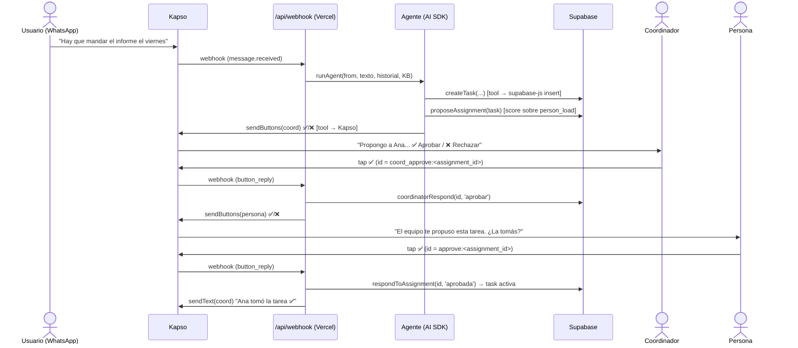

# RFC · Hornero — Diseño técnico

> **Estado:** Draft · **Fecha:** 6 de junio de 2026 · **Autores:** equipo Hornero (Backend · ML · Data)
> **Documento de producto (what/why):** ver el PRD `PRD-coordinador-ong-whatsapp.md`
> Este RFC cubre el **cómo**: arquitectura, acceso a datos, el agente, la integración con WhatsApp y las piezas que más dudas generan.

---

## 1. Resumen

Hornero es un agente que vive en WhatsApp y coordina el trabajo de una ONG: registra personas y tareas, propone asignaciones que un coordinador aprueba y la persona confirma, mantiene una memoria de la organización, y al cerrar cada tarea arma un Balance de Impacto.

Técnicamente son cuatro piezas:
1. Un **webhook** (Vercel) que recibe los mensajes de WhatsApp vía **Kapso**.
2. Un **agente** (Vercel AI SDK) que interpreta el mensaje y llama *tools*.
3. Las **tools**, que son funciones que leen/escriben en **Supabase** (`supabase-js`) y mandan mensajes por **Kapso**.
4. **Supabase (Postgres)** como única fuente de verdad de los datos operativos + el knowledge base.

El principio rector: **toda la lógica vive en tools deterministas; el LLM solo orquesta e interpreta lenguaje natural.** Esto hace el sistema testeable y robusto a alucinaciones.

---

## 2. Objetivos y no-objetivos

**Objetivos**
- Un loop end-to-end funcionando: onboarding → tarea → propuesta → aprobación coordinador → confirmación persona → cierre con balance → consulta.
- Acceso a datos simple, tipado y confiable desde el runtime del agente.
- Robustez de demo: que no dependa de que el LLM "se porte bien".

**No-objetivos (MVP)**
- Autenticación, RLS, multi-organización, RBAC (solo existe `is_coordinator`).
- RAG / `pgvector` (el KB se carga entero en contexto; ver §8).
- WhatsApp Flows (requieren verificación de Meta; ver §7.4).
- Alta disponibilidad, colas robustas, observabilidad de producción.

---

## 3. Arquitectura general

```
WhatsApp  ──►  Kapso  ──(webhook)──►  /api/webhook (Vercel)
   ▲            ▲                          │
   │            │                          ▼
   │            │                   Agente (Vercel AI SDK)
   │            │                          │  tool calls
   │            │              ┌───────────┼───────────┐
   │            │              ▼           ▼           ▼
   │            └────(send)── tools     tools        tools
   │                          (Kapso)  (Supabase)  (lógica)
   └───────────────────────────────────────┘
                                            ▼
                                   Supabase (Postgres)
                          people · tasks · assignments ·
                          knowledge · impact_reports · sessions
```

### Lifecycle de una interacción (crear tarea → aprobación)



**Decisión clave:** los taps de botón **no pasan por el LLM** — el `id` del botón codifica la acción (`coord_approve:<id>`, `approve:<id>`, `done:<task_id>`) y el webhook llama la tool directo. El LLM solo entra para texto libre (onboarding, alta de tarea, consultas, cierre).

---

## 4. Acceso a datos: `supabase-js` + tools  *(la duda principal)*

**El malentendido a despejar:** el agente *no* "se conecta" a Supabase ni usa el MCP en runtime. **El agente lee y escribe llamando tools, y cada tool es una función async normal que adentro corre una query con `supabase-js`.** El LLM nunca toca la base; siempre pasa por tus funciones.

### 4.1 Cliente (server-side)

```ts
// lib/supabase.ts
import { createClient } from '@supabase/supabase-js'

// Service role key: SOLO en el server (el webhook corre en el server). Nunca en el cliente.
export const supabase = createClient(
  process.env.SUPABASE_URL!,
  process.env.SUPABASE_SERVICE_ROLE_KEY!
)
```

### 4.2 Una tool de lectura, completa

```ts
// tools/getBoard.ts
import { tool } from 'ai'
import { z } from 'zod'
import { supabase } from '../lib/supabase'

export const getBoard = tool({
  description: 'Estado del tablero: tareas por estado, asignaciones pendientes de aprobación, ' +
               'alertas de vencimiento e impacto reciente. Usar cuando preguntan "¿cómo venimos?".',
  parameters: z.object({}),               // sin args
  execute: async () => {
    const { data: tasks }   = await supabase.from('tasks').select('*')
                                            .order('deadline', { ascending: true })
    const { data: pending } = await supabase.from('assignments')
                                            .select('*, tasks(*), people(*)')
                                            .eq('status', 'propuesta')
    const { data: impact }  = await supabase.from('impact_reports')
                                            .select('headline, created_at')
                                            .order('created_at', { ascending: false }).limit(5)

    const now = Date.now()
    const columns = groupBy(tasks ?? [], t => t.status)
    const alerts  = (tasks ?? []).filter(t =>
      t.deadline && new Date(t.deadline).getTime() < now + 24 * 3600 * 1000 &&
      !['hecha'].includes(t.status))

    return { columns, pending_approval: pending ?? [], alerts, recent_impact: impact ?? [] }
  },
})
```

### 4.3 Una tool de escritura + efecto (propone y avisa al coordinador)

```ts
// tools/proposeAssignment.ts
export const proposeAssignment = tool({
  description: 'Elige el mejor candidato para una tarea (skills + carga) y manda la propuesta ' +
               'al coordinador para que apruebe. Usar después de crear o priorizar una tarea.',
  parameters: z.object({ task_id: z.string() }),
  execute: async ({ task_id }) => {
    const { data: task } = await supabase.from('tasks').select('*').eq('id', task_id).single()
    const { data: load } = await supabase.from('person_load').select('*')   // vista con carga real

    const { candidate, reason } = scoreCandidates(task!, load ?? [])        // heurística (ver PRD §10)

    const { data: a } = await supabase.from('assignments')
      .insert({ task_id, person_id: candidate.id, status: 'propuesta', reason })
      .select().single()

    const { data: coord } = await supabase.from('people')
      .select('*').eq('is_coordinator', true).limit(1).single()

    await sendButtons(coord!.wa_phone,
      `Propongo a *${candidate.name}* para "${task!.title}" (vence ${fmt(task!.deadline)}).\n${reason}`,
      [{ id: `coord_approve:${a!.id}`, title: '✅ Aprobar' },
       { id: `coord_reject:${a!.id}`,  title: '❌ Rechazar' }])

    return { assignment: a, candidate, reason }
  },
})
```

**Por qué tools-as-functions y no MCP en runtime:** el MCP de Supabase es para *gestión* (crear tablas, migraciones) y agrega un proceso + round-trips. Para CRUD en runtime, `supabase-js` directo es tipado, una sola llamada y sin infra extra. El MCP lo usamos en **dev-time** desde Claude Code para armar el esquema, la vista y el seed (ver §12).

---

## 5. El agente (Vercel AI SDK)

### 5.1 Registro de tools y llamada

```ts
// lib/agent.ts
import { generateText, stepCountIs } from 'ai'
import { anthropic } from '@ai-sdk/anthropic'   // swappable: @ai-sdk/openai, etc.

import { getBoard, createTask, proposeAssignment, coordinatorRespond,
         respondToAssignment, markTaskDone, inferImpactQuestions, recordImpactReport,
         upsertPerson, getPerson, addKnowledge, inferKnowledge,
         sendText, sendButtons, sendList } from '../tools'

const tools = { getBoard, createTask, proposeAssignment, coordinatorRespond,
                respondToAssignment, markTaskDone, inferImpactQuestions, recordImpactReport,
                upsertPerson, getPerson, addKnowledge, inferKnowledge,
                sendText, sendButtons, sendList }

export async function runAgent(waPhone: string, text: string) {
  const person   = await getPersonByPhone(waPhone)        // null si no existe → onboarding
  const session  = await getSession(waPhone)              // estado de flujo multi-turno (§6)
  const messages = await loadHistory(waPhone)             // historial de la conversación (§6)
  const kb       = await loadKnowledge()                  // KB entero, va al system prompt (§8)

  const { text: reply } = await generateText({
    model: anthropic('claude-...'),                       // el modelo que tengan
    system: buildSystemPrompt({ person, session, kb }),
    messages: [...messages, { role: 'user', content: text }],
    tools,
    stopWhen: stepCountIs(8),     // tool calling multi-paso (AI SDK v5). En v4: maxSteps: 8
  })

  if (reply) await sendText(waPhone, reply)               // respuesta en lenguaje natural
  await appendHistory(waPhone, text, reply)
}
```

> **Versión del SDK:** v5 usa `stopWhen: stepCountIs(n)`; v4 usaba `maxSteps: n`. Confirmar contra los docs del AI SDK que tengan instalado.

### 5.2 System prompt (estructura)

El system prompt arma el contexto del agente en cada turno:
- **Rol y reglas:** "Sos el asistente de coordinación de una ONG en WhatsApp. Baja fricción. Nunca asignás sin que el coordinador apruebe. Nunca inventás números."
- **Knowledge base completo** (inyectado como texto — ver §8).
- **Persona actual** (si existe) o instrucción de onboarding (si `person == null`).
- **Estado de sesión** (si está en medio de un onboarding o de un cierre de impacto, ej.: "Estás recolectando respuestas de impacto para la tarea X; pregunta pendiente: …").
- **Catálogo de cuándo usar cada tool.**

### 5.3 Routing: botones vs. texto
El routing duro lo hace el webhook (§7.1): si llega un `button_reply`, se llama la tool directo. Si llega texto, entra el agente y **el LLM decide** qué tool usar según la intención (onboarding / nueva tarea / consulta / cierre / agregar conocimiento).

---

## 6. Estado de conversación en serverless

**Problema:** el webhook es *stateless* (cada invocación arranca de cero), pero los flujos son multi-turno (onboarding pide 3-4 datos; el cierre de impacto hace 2-4 preguntas). Hay que persistir dos cosas: **el historial** y **el estado del flujo**.

```sql
-- Estado de flujo multi-turno
create table sessions (
  wa_phone text primary key,
  state text,                  -- null | 'onboarding' | 'impact:<task_id>'
  context jsonb default '{}',  -- respuestas parciales, índice de pregunta actual, etc.
  updated_at timestamptz default now()
);

-- Historial de conversación (para reconstruir `messages` del LLM)
create table messages (
  id bigserial primary key,
  wa_phone text not null,
  role text not null,          -- 'user' | 'assistant'
  content text not null,
  created_at timestamptz default now()
);
```

- `loadHistory(waPhone)` trae los últimos N mensajes (ej. 20) para darle contexto al LLM.
- `getSession`/`setSession` marcan "estamos en medio de X". El system prompt lo refleja y el agente sabe qué pregunta sigue.
- **Alternativa:** Kapso ya guarda las conversaciones (API `list-messages`), así que se podría reconstruir el historial desde Kapso en lugar de duplicarlo. Para el MVP, tabla local = más simple y rápido; Kapso como fuente = menos duplicación pero más latencia. **Recomendado MVP: tabla local.**

---

## 7. Integración Kapso / WhatsApp

Kapso es una capa sobre la **WhatsApp Cloud API**. Autenticación por header `X-API-Key`. Base: `https://api.kapso.ai/meta/whatsapp/v24.0/{phone_number_id}/...`.

> **Caveat de exactitud:** los shapes de abajo siguen el formato estándar de la Cloud API y lo visto en los docs de Kapso, pero **confirmá los nombres de campo exactos y el helper `normalizeWebhook` contra los docs de Kapso y el repo `gokapso/whatsapp-cloud-api-js`** antes de codear fino.

### 7.1 Webhook entrante

```ts
// app/api/webhook/route.ts  (Next.js App Router)
import { normalizeWebhook } from '@kapso/sdk'   // confirmar import exacto

export async function POST(req: Request) {
  const event = normalizeWebhook(await req.json())
  if (event.type !== 'whatsapp.message.received') return Response.json({ ok: true })

  const msg  = event.message
  const from = msg.from

  // 1) ¿respuesta de botón? → tool directo, sin LLM
  const buttonId = msg.interactive?.button_reply?.id    // ej. "coord_approve:uuid"
  if (buttonId) {
    await handleButton(from, buttonId)
    return Response.json({ ok: true })
  }

  // 2) texto → agente
  await runAgent(from, msg.text?.body ?? '')
  return Response.json({ ok: true })
}

async function handleButton(from: string, id: string) {
  const [action, arg] = id.split(':')
  if (action === 'coord_approve') return coordinatorRespond.execute({ assignment_id: arg, decision: 'aprobar' })
  if (action === 'coord_reject')  return coordinatorRespond.execute({ assignment_id: arg, decision: 'rechazar' })
  if (action === 'approve')       return respondToAssignment.execute({ assignment_id: arg, decision: 'aprobada' })
  if (action === 'reject')        return respondToAssignment.execute({ assignment_id: arg, decision: 'rechazada' })
  if (action === 'done')          return startImpactFlow(from, arg)   // markTaskDone + primera pregunta
}
```

### 7.2 Envío de mensajes interactivos

```ts
// lib/kapso.ts
const PHONE = process.env.KAPSO_PHONE_NUMBER_ID!
const URL   = `https://api.kapso.ai/meta/whatsapp/v24.0/${PHONE}/messages`
const HEAD  = { 'X-API-Key': process.env.KAPSO_API_KEY!, 'Content-Type': 'application/json' }

export async function sendText(to: string, body: string) {
  await fetch(URL, { method: 'POST', headers: HEAD,
    body: JSON.stringify({ messaging_product: 'whatsapp', to, type: 'text', text: { body } }) })
}

export async function sendButtons(to: string, body: string, buttons: {id:string; title:string}[]) {
  await fetch(URL, { method: 'POST', headers: HEAD, body: JSON.stringify({
    messaging_product: 'whatsapp', to, type: 'interactive',
    interactive: {
      type: 'button',
      body: { text: body },
      action: { buttons: buttons.slice(0, 3).map(b => ({ type: 'reply', reply: b })) }, // máx 3
    },
  }) })
}

export async function sendList(to: string, body: string, rows: {id:string; title:string; description?:string}[]) {
  await fetch(URL, { method: 'POST', headers: HEAD, body: JSON.stringify({
    messaging_product: 'whatsapp', to, type: 'interactive',
    interactive: {
      type: 'list',
      body: { text: body },
      action: { button: 'Ver', sections: [{ title: 'Opciones', rows: rows.slice(0, 10) }] }, // máx 10
    },
  }) })
}
```

### 7.3 Ventana de 24 horas
WhatsApp solo permite mensajes libres (no-template) dentro de las **24 h** desde el último mensaje del usuario. Como Hornero es reactivo, casi todo cae adentro. **Los recordatorios proactivos** (cron) que salgan fuera de esa ventana requieren un **template** aprobado. Para el MVP: o se mandan dentro de la ventana, o se deja el recordatorio como nice-to-have.

### 7.4 UI: qué se puede renderizar
La paleta la fija WhatsApp: **botones (≤3), listas (≤10 filas), media, y Flows.** Botones + listas + texto formateado alcanzan para tablero/approve/cierre **sin bloqueante**. **Flows** (pantallas tipo formulario) requieren **Meta Business Portfolio verificado** (requisito de Meta). Posible atajo: un número pre-verificado provisto por Kapso podría habilitarlos sin trámite propio — **confirmar con Kapso, no apostar la demo**.

### 7.5 Repos de referencia
- `gokapso/whatsapp-cloud-inbox` — botones/listas interactivas + ventana de 24 h (la referencia más directa).
- `gokapso/whatsapp-cloud-api-js` — cliente TS (confirmar shapes exactos acá).
- `gokapso/agent-skills`, `gokapso/claude-code-whatsapp` — patrón de agente sobre WhatsApp.
- **Sandbox de Kapso** para la demo (sin número productivo).

### 7.6 Robustez del webhook (importante)
Kapso/Meta **reintentan** si el webhook tarda. El agente + tool calls puede exceder el timeout de una función serverless. Dos mitigaciones:
- Responder `200` **rápido** y procesar el agente en background (`waitUntil` en Vercel, o una cola).
- Para los taps de botón, la tool es rápida → responder inline está bien.
- **Idempotencia:** guardá el `message_id` procesado y descartá reintentos duplicados (evita doble asignación / doble balance).

---

## 8. Knowledge base estilo "LLM Wiki"

Inspirado en el patrón LLM Wiki (gist de Karpathy): en vez de RAG, el conocimiento de la ONG se **mantiene y se carga entero en contexto**.

- **Escala:** una ONG chica son unos pocos miles de tokens — *muy* por debajo del umbral (~50-100k) donde RAG empieza a convenir. Cargar todo en el system prompt es **más simple y más confiable** (100 % de "recall", sin chunking que rompa el sentido, sin vector DB).
- **Storage:** filas de texto en `knowledge` (barato). `loadKnowledge()` trae todo y se inyecta en el prompt.
- **Mantenimiento (lo que importa):** `inferKnowledge(conversationText)` **integra y deduplica** — si el agente aprende "Ana sabe diseño", revisa/actualiza en vez de apilar una fila nueva igual. Esto evita el KB lleno de duplicados (el problema que marcan en los comentarios del gist).
- **Post-MVP:** cuando el KB no entre en contexto, recién ahí `pgvector` + retrieval. Hoy no.

---

## 9. Balance de Impacto: mecánica

```ts
// Disparado por el botón done:<task_id>
async function startImpactFlow(from: string, taskId: string) {
  await markTaskDone.execute({ task_id: taskId })                 // status → 'hecha'
  const { task_type, questions } = await inferImpactQuestions.execute({ task_id: taskId })
  await setSession(from, `impact:${taskId}`, { task_type, questions, answers: {}, i: 0 })
  await sendText(from, questions[0])                              // primera pregunta, de a una
}
```

- `inferImpactQuestions` clasifica el tipo de tarea (de título/descripción + KB) y genera **2-4 preguntas cuantificables a medida** (charla ≠ informe; ver tabla de arquetipos en el PRD §7).
- Mientras `session.state == 'impact:<id>'`, cada texto del usuario se guarda como respuesta y se manda la siguiente pregunta. Al completar, `recordImpactReport` arma el **Balance** (inversión / resultado / impacto / titular), lo persiste y lo manda a persona + coordinador.
- **Regla dura:** el agente **solo registra lo que responde la persona; nunca estima ni inventa números** (esto va a un donante).

---

## 10. Doble aprobación: máquina de estados

Estado en `assignments.status`:

```
                proposeAssignment
   (nada) ───────────────────────► propuesta
                                       │
                  coordinatorRespond   │
        ┌──────────────┬───────────────┤
        ▼              ▼               ▼
   'rechazar'     'reasignar'      'aprobar'
        │         (re-propone)         │
        ▼          → propuesta         ▼
   task→pendiente                 aprobada_coord
                                       │
                respondToAssignment    │
                  ┌────────────────────┤
                  ▼                    ▼
             'rechazada'          'aprobada'
                  │                    │
       re-propone siguiente      task→aprobada/en_curso
       candidato → propuesta          + tablero + aviso a coordinador
```

- El `reason` (por qué el agente propuso) viaja en la propuesta al coordinador para que decida informado.
- `rejected_by` ('coordinador' | 'persona') queda registrado para trazabilidad.
- **Configurable:** exigir aprobación del coordinador siempre (MVP) o solo para ciertas tareas/personas (prod).

---

## 11. Consideraciones de robustez y seguridad

- **Service role key** de Supabase: solo server-side (el webhook). Nunca al cliente.
- **Firma del webhook:** verificar la firma/secret de Kapso si está disponible, para no procesar requests falsos.
- **Idempotencia:** dedupe por `message_id` (Kapso/Meta reintentan).
- **Timeout:** responder rápido + procesar en background (§7.6).
- **RLS off** en el MVP (es demo). Deuda técnica explícita para producción.
- **Lógica en tools + Zod:** el LLM no ejecuta SQL ni decide solo; valida y orquesta.

---

## 12. Plan de implementación

Detalle y reparto por rol en el **PRD §12**. Resumen del orden técnico:
1. **Bloque 0 (juntos):** definir las firmas de tools (este RFC §4-5) y los estados (`task`/`assignment`). Crear repo + proyectos Vercel/Supabase.
2. **Data Engineer:** esquema vía **MCP de Supabase** en Claude Code (tablas + `person_load` + `sessions`/`messages` + seed con 1 coordinador) + wrappers `supabase-js`.
3. **Backend:** `/api/webhook` + helpers Kapso (`sendText/Buttons/List`) + routing de botones + Sandbox + deploy temprano (URL pública, no túneles).
4. **ML:** system prompt + agente (`generateText` + tools + multi-step) + `proposeAssignment`/scoring + `inferImpactQuestions`/`recordImpactReport`.
5. **2:30–3:30:** todo al Balance de Impacto (feature estrella).

---

## 13. Alternativas consideradas

| Alternativa | Por qué no (para el MVP) |
|---|---|
| **MCP de Supabase en runtime** | Proceso extra + round-trips; pensado para gestión, no CRUD. `supabase-js` directo es más simple y tipado. (MCP sí en dev-time.) |
| **RAG / `pgvector` para el KB** | A esta escala (pocos miles de tokens) cargar todo en contexto es más simple y confiable. RAG sería overhead y bajaría la confiabilidad. |
| **WhatsApp Flows para el tablero** | Requieren Meta Business Portfolio verificado (trámite de días). Botones + listas no tienen bloqueante. |
| **Buckets / KV para datos operativos** | Necesitan joins (carga, impacto, aprobaciones). Buckets son para archivos; no hay KV nativo. Relacional gana. |
| **Comandos (`/tarea crear`)** | Fricción alta para equipos no técnicos. Lenguaje natural + botones es el punto del producto. |

---

## 14. Preguntas abiertas

1. **Shapes exactos de Kapso:** confirmar `normalizeWebhook`, campos del `button_reply`, y el body de envío contra docs + `whatsapp-cloud-api-js`.
2. **Flows sin verificación:** ¿el número pre-verificado de Kapso habilita Flows en la demo? (Si sí, el tablero podría ser un Flow read-only.)
3. **Historial:** ¿tabla local de `messages` o reconstruir desde la API de Kapso? (MVP: local.)
4. **Background processing:** ¿`waitUntil` alcanza para el timeout del agente o hace falta una cola? (Medir con el modelo elegido.)
5. **Versión del AI SDK:** confirmar `stopWhen: stepCountIs(n)` (v5) vs `maxSteps` (v4).
6. **Multi-coordinador:** ¿uno seedeado o varios con "primero que responde decide"? (MVP: uno.)
